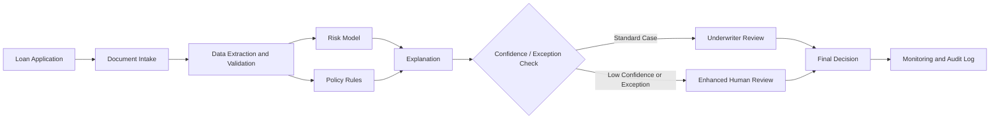

# SmartLend AI: Explainable Small-Business Loan Underwriting Assistant

**Building AI course project**

## Summary

SmartLend AI is a human-supervised loan-underwriting assistant for small-business lenders. It combines verified financial data, document analysis, and machine-learning risk scoring to speed up review while keeping explanations, fairness checks, and final lending decisions under human control.

## Background

Small-business loan underwriting can be slow because underwriters must review applications, bank statements, tax documents, credit information, existing debt, and business performance before making a decision. Much of this work is repetitive, but the final decision can have a major financial impact on both the applicant and the lender.

The project addresses several problems:

* manual document review and repeated data entry can delay decisions
* different underwriters may interpret similar information differently
* traditional credit scores may not fully reflect the current condition of a small business
* lenders need to explain important credit decisions and monitor for unfair outcomes
* applicants benefit when missing information and major risk factors are identified earlier

My goal is not to replace underwriters. SmartLend AI is designed as a decision-support system that helps people review information consistently and focus their attention on cases that require professional judgment.

## How is it used?

A small-business applicant submits a loan application and supporting documents through a lender's digital portal. The system checks whether required documents are present and extracts approved financial information from the application and uploaded records.

The workflow would be:

1. **Application intake:** collect business information, requested loan amount, owner information, and supporting documents.
2. **Document processing:** use optical character recognition and document classification to convert statements and forms into structured fields.
3. **Data verification:** compare values across documents and flag missing or inconsistent information.
4. **Risk analysis:** use an approved machine-learning model to estimate repayment risk from financial and credit variables.
5. **Policy checks:** compare the application with lender rules such as minimum time in business or required cash-flow coverage.
6. **Explanation:** show the main factors that influenced the model's recommendation.
7. **Human review:** route low-confidence, unusual, or policy-exception cases to an underwriter. The human underwriter remains responsible for the final decision.
8. **Monitoring:** record model performance, overrides, data-quality issues, and outcome differences so the lender can identify drift or unfair patterns.

The main users are loan applicants, operations employees, credit analysts, underwriters, compliance teams, model-risk teams, and lender management. Applicants need timely and understandable decisions, while employees need reliable information and clear reasons behind system recommendations.



## Data sources and AI methods

### Data sources

The strongest version of the system would use only data that the lender is legally permitted to collect and that can be justified for underwriting. Useful data can include:

* historical loan applications and repayment outcomes
* business bank-account cash-flow data, with permission
* credit-bureau information
* business revenue, expenses, balances, and debt obligations
* time in business and industry information
* tax returns and financial statements
* prior repayment performance with the lender
* document-quality and verification indicators

Permissioned bank cash-flow data is especially useful because it can provide a current view of deposits, recurring expenses, liquidity, and debt payments. It should supplement rather than automatically replace traditional underwriting information.

Protected characteristics should not be used as model features for making credit decisions. However, where legally permitted, appropriate demographic information may be retained separately for fair-lending testing and monitoring.

### AI methods

Several AI techniques can work together in this solution:

**Machine learning:** A classification model can estimate the probability of serious delinquency or default. A simple interpretable baseline such as logistic regression should be compared with more flexible models such as random forests or gradient boosting.

**Natural language processing and document AI:** OCR and text extraction can identify fields in bank statements, tax documents, and other financial records. The system can classify documents and detect missing information.

**Anomaly detection:** Statistical or machine-learning methods can flag unusual transaction patterns, conflicting document values, or applications that are very different from the training population.

**Explainable AI:** Feature importance and reason codes can help underwriters understand the factors that influenced a risk estimate. Explanations should be tested for accuracy and should not be treated as a substitute for legal compliance.

**Human-in-the-loop decision support:** AI produces recommendations, not unquestionable decisions. Low-confidence cases, exceptions, and potentially adverse outcomes receive appropriate human review.

The included prototype demonstrates a small logistic-regression credit-risk model using **synthetic data only**. It is an educational example and is not suitable for real lending decisions.

## Prototype

### Files

* `prototype.py` - creates a synthetic lending dataset, trains a logistic-regression model, prints evaluation metrics, and scores one example application
* `data/sample_applications.csv` - small synthetic sample for illustration
* `requirements.txt` - Python dependencies

### Run the demo

```bash
python -m venv .venv
source .venv/bin/activate
pip install -r requirements.txt
python prototype.py
```

On Windows:

```bash
python -m venv .venv
.venv\Scripts\activate
pip install -r requirements.txt
python prototype.py
```

## Challenges

SmartLend AI does not eliminate the difficult parts of lending. Important limitations include:

* **Bias and fairness:** historical lending data may contain past disparities. A model can reproduce them even if protected characteristics are removed.
* **Data quality:** incomplete or incorrect financial records can create unreliable predictions.
* **Explainability:** a technically accurate model may still be inappropriate if its decisions cannot be explained well enough for users, auditors, or regulators.
* **Privacy and security:** bank transactions, credit information, and financial statements are sensitive and require strong access controls.
* **Model drift:** borrower behavior, economic conditions, and portfolio risk can change over time.
* **Automation bias:** employees may trust a model too much simply because it appears quantitative or sophisticated.
* **Regulatory requirements:** lenders remain responsible for fair-lending, adverse-action, privacy, model-risk, and recordkeeping requirements.
* **Limited prototype:** the demonstration in this repository uses synthetic data and cannot establish real-world accuracy or fairness.

Because of these limitations, the project is designed around controlled use, continuous monitoring, and meaningful human oversight.

## What next?

A realistic next phase would be a controlled pilot using de-identified historical data from a lender. The project would compare several models against the lender's current process and measure predictive performance, processing time, approval consistency, override rates, and fairness indicators.

Future improvements could include:

* stronger document extraction for bank statements and tax records
* permissioned bank-data APIs
* model-drift and fairness dashboards
* automated data-quality checks
* multilingual applicant support
* AI agents that coordinate document intake, policy checks, explanation generation, and monitoring within strict permissions
* independent model validation and stress testing
* applicant reconsideration workflows for correcting inaccurate data
* integration with a loan-origination system

The long-term goal would be a system that makes underwriting faster and more consistent without removing human accountability.

## Acknowledgments

This project was inspired by coursework from the **Elements of AI / Building AI** program by the University of Helsinki and Reaktor.

Research and guidance that informed the project include:

* National Institute of Standards and Technology. [Artificial Intelligence Risk Management Framework (AI RMF 1.0)](https://doi.org/10.6028/NIST.AI.100-1)
* Board of Governors of the Federal Reserve System et al. [Interagency Statement on the Use of Alternative Data in Credit Underwriting](https://www.federalreserve.gov/newsevents/pressreleases/files/bcreg20191203b1.pdf)
* Consumer Financial Protection Bureau. [Adverse Action Notification Requirements and the Proper Use of the CFPB's Sample Forms](https://www.consumerfinance.gov/compliance/circulars/circular-2023-03-adverse-action-notification-requirements-and-the-proper-use-of-the-cfpbs-sample-forms-provided-in-regulation-b/)
* Bussmann, N., Giudici, P., Marinelli, D., & Papenbrock, J. (2021). Explainable machine learning in credit risk management. *Computational Economics, 57*, 203-216.
* Jagtiani, J., & Lemieux, C. (2019). The roles of alternative data and machine learning in fintech lending: Evidence from the LendingClub consumer platform. *Financial Management, 48*(4), 1009-1029.
* scikit-learn contributors. [scikit-learn documentation](https://scikit-learn.org/)

The prototype code in this repository is original educational code created for this project. The included sample data is synthetic and does not contain real borrower information.

## License

This project is provided for educational purposes under the MIT License.
